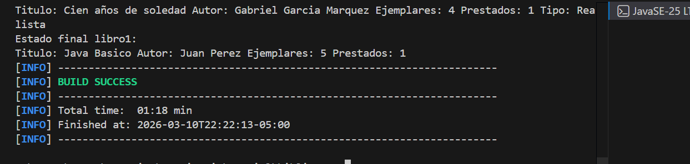
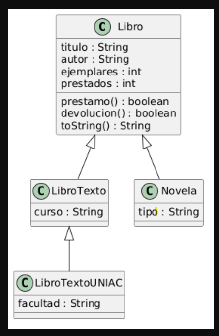

# Sistema de Gestión de Biblioteca

Proyecto desarrollado en Java utilizando Maven que implementa un sistema de biblioteca aplicando los principios de Programación Orientada a Objetos (POO): abstracción, encapsulamiento y herencia.

## Clases del sistema

* Libro
* LibroTexto
* LibroTextoUNIAC
* Novela

## Funcionalidades

* Registrar libros
* Realizar préstamo de libros
* Realizar devolución de libros
* Mostrar información de los libros


mvn exec:java -Dexec.mainClass="com.biblioteca.Main"

## Ejecución del programa

Aquí se muestra una captura del programa funcionando.






## Diagrama UML

```text
+---------------------------+
|           Libro           |
+---------------------------+
| - titulo : String         |
| - autor : String          |
| - ejemplares : int        |
| - prestados : int         |
+---------------------------+
| + prestamo() : boolean    |
| + devolucion() : boolean  |
| + toString() : String     |
+---------------------------+
            ▲
            |
+---------------------------+
|        LibroTexto         |
+---------------------------+
| - curso : String          |
+---------------------------+
            ▲
            |
+------------------------------+
|       LibroTextoUNIAC        |
+------------------------------+
| - facultad : String          |
+------------------------------+

            ▲
            |
+---------------------------+
|          Novela           |
+---------------------------+
| - tipo : String           |
+---------------------------+
```
